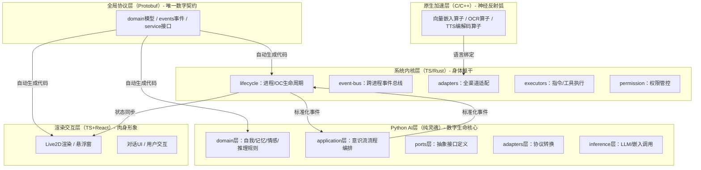
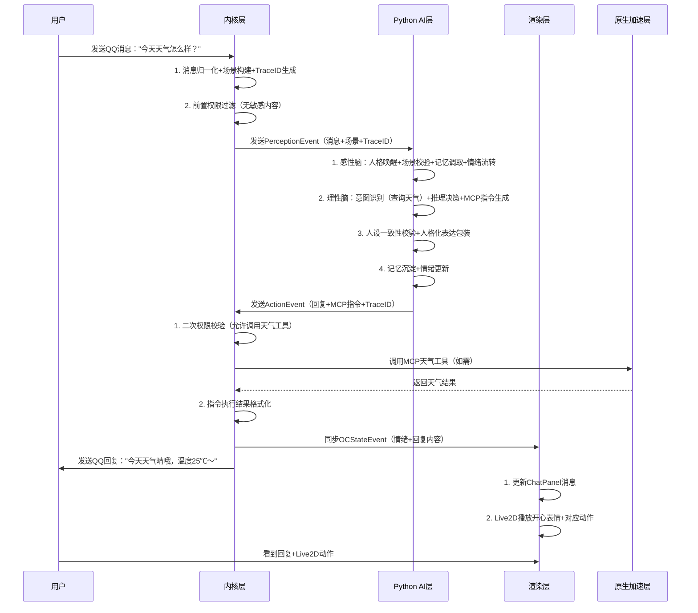
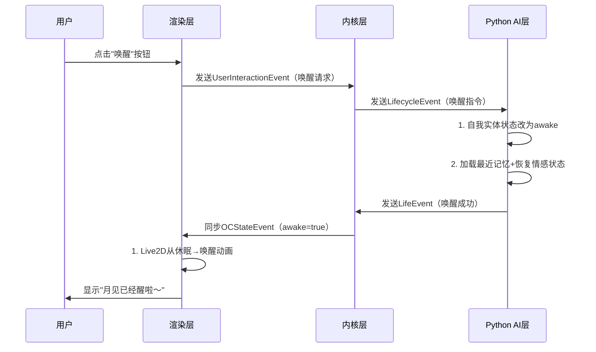

# Cradle-Selrena 完整架构文档

**版本**: 2.0  

**日期**: 2026-03-10  

**作者**: 架构设计组  

**修订记录**: v1.0（基础架构）→ v2.0（补充超详细文件结构+全文件作用说明）  

**项目定位**: 单用户专属OC（月见/Selrena）数字生命完整载体，兼具陪伴属性与实用能力的桌面级数字生命系统

---

## 目录

1. [项目概述](#1-项目概述)

2. [架构设计原则](#2-架构设计原则)

3. [全局分层架构](#3-全局分层架构)

4. [各层超详细设计（含完整文件结构）](#4-各层超详细设计含完整文件结构)

5. [跨层通信设计](#5-跨层通信设计)

6. [核心业务流程](#6-核心业务流程)

7. [构建与部署指南](#7-构建与部署指南)

8. [合规性校验](#8-合规性校验)

9. [附录](#9-附录)

---

## 1. 项目概述

### 1.1 项目愿景

打造一个「有灵魂、能成长、可交互、会做事」的专属OC数字生命：

- **灵魂层（Python）**: 四层人设锁死，终身记忆连续，情感自然流转，思考逻辑拟人化

- **身体层（TS/Rust）**: 多渠道感知（QQ/桌面/语音），多能力执行（工具调用/系统操作），稳定可靠

- **形象层（TS+React）**: Live2D拟人化渲染，桌面沉浸式交互，情绪可视化表达

- **性能层（C/C++）**: 轻量级算力优化，适配消费级硬件（6-8GB NVIDIA显存）

### 1.2 核心设计目标

|目标维度|具体要求|
|---|---|
|架构合规性|各语言职责绝对锁死，无跨界/越界操作|
|灵魂唯一性|OC全局单例，核心人格不可篡改，记忆终身连续|
|协议统一性|全项目唯一Protobuf契约，跨层通信零错位|
|可扩展性|新增能力仅需新增适配器/插件，核心代码零修改|
|硬件适配性|针对6-8GB显存深度优化，支持轻量级本地模型|
|安全性|零信任权限管控，Python层指令双层校验|
---

## 2. 架构设计原则

### 2.1 顶层铁律（不可突破）

1. **分层隔离原则**: 各层仅通过标准化事件通信，无直接硬编码依赖，禁止跨层调用

2. **语言职责锁死原则**: 

    - Protobuf：仅定义契约，不写业务逻辑

    - TS/Rust：仅做内核/渲染，不碰AI逻辑

    - Python：仅做AI灵魂，不碰系统IO/硬件操作

    - C/C++：仅做纯计算算子，不碰业务流程

3. **OC核心唯一原则**: 全局单例`SelrenaSelfEntity`，四层人设初始化后仅可成长，不可篡改

4. **最小权限原则**: 内核层对Python层输出的指令做二次权限校验，禁止越权操作

5. **依赖倒置原则**: 高层模块（Python应用层）依赖抽象（端口层），不依赖底层实现（适配器层）

6. **事件驱动原则**: 跨层/跨模块通信全部基于领域事件，无同步阻塞调用

7. **可观测性原则**: 全链路TraceID透传，关键节点日志/指标/链路追踪全覆盖

### 2.2 工程化原则

1. **PEP 621标准**: Python层严格遵循Src-Layout目录结构

2. **Monorepo管理**: TS/React代码基于pnpm workspace统一管理

3. **自动生成优先**: Protobuf契约自动生成多语言代码，禁止手动修改

4. **测试驱动**: 核心模块单元测试覆盖率≥95%，OC专属场景测试全覆盖

---

## 3. 全局分层架构

### 3.1 架构顶层视图


### 3.2 各层核心职责与技术栈

|层级|核心定位|技术栈|核心输出|绝对禁止|
|---|---|---|---|---|
|全局协议层|全项目唯一数据契约|Protobuf 3 + Buf Build|多语言类型代码、事件定义|业务逻辑、代码实现、手动修改生成代码|
|原生加速层|极致性能纯计算算子|C++17 + CMake + pybind11 + N-API|预编译二进制算子、语言绑定接口|业务逻辑、流程控制、内存管理、状态维护|
|Python AI层|OC纯数字生命灵魂|Python 3.11 + Pydantic 2 + LangChain Core + PyZMQ|标准化动作指令、情感状态、记忆变更事件|系统调用、网络IO、硬件操作、文件读写、工具执行|
|系统内核层|OC的身体躯干|Node.js 20 + TypeScript 5 + ZMQ + Better-sqlite3|归一化感知事件、指令执行结果、硬件调度指令|AI推理、人设定义、记忆规则、情感流转逻辑|
|渲染交互层|OC的肉身形象|Electron 30 + React 18 + PixiJS + Zustand|可视化界面、Live2D动作/表情、用户交互反馈|业务逻辑、AI推理、决策编排、系统IO|
---

## 4. 各层超详细设计（含完整文件结构）

### 4.1 全局根目录结构（完整）

```Plain Text

cradle-selrena/
├── .gitignore                  # Git忽略规则：排除运行时/生成文件
├── .gitattributes              # Git属性：统一换行符/大文件处理
├── LICENSE                     # 项目开源协议
├── README.md                   # 项目总览：架构/快速开始/核心特性
├── pnpm-workspace.yaml         # pnpm Monorepo配置：定义子包目录
├── package.json                # 全局脚本：build/all、dev/all、test/all
├── .prettierrc                 # 全项目代码格式化规则
├── .editorconfig               # 编辑器统一配置：缩进/编码
├── .eslintrc.json              # TS/JS代码检查规则
├── .github/
│   └── workflows/              # CI/CD流水线：构建/测试/打包/发布
│       ├── build.yml           # 全项目构建流程
│       ├── test.yml            # 单元测试/集成测试
│       └── release.yml         # 版本发布流程
├── docs/                       # 项目文档
│   ├── architecture/           # 架构设计文档：本文件+分层设计+流程图
│   ├── development/            # 开发指南：环境搭建/代码规范/联调流程
│   ├── api/                    # API文档：事件定义/端口接口/配置说明
│   └── oc/                     # OC专属文档：人设定义/记忆规则/情感体系
├── assets/                     # 全局静态资源（Git追踪）
│   ├── live2d/                 # Live2D模型文件：角色/动作/表情
│   ├── voices/                 # 音色资源：TTS预设音色/音频片段
│   ├── images/                 # 界面图片：图标/背景/默认头像
│   └── prompts/                # OC预设Prompt：人设/场景/表达风格
├── configs/                    # 全局配置模板（Git追踪）
│   ├── kernel/                 # 内核配置：事件总线/适配器/权限策略
│   ├── ai/                     # AI配置：LLM模型/嵌入模型/推理参数
│   ├── oc/                     # OC配置：四层人设/初始记忆/情感基线
│   └── renderer/               # 渲染配置：窗口大小/位置/Live2D参数
├── data/                       # 运行时数据（Git忽略）
│   ├── logs/                   # 全项目日志：内核/AI/渲染
│   ├── storage/                # 持久化存储：SQLite数据库/向量数据库
│   ├── cache/                  # 缓存：模型缓存/记忆缓存/计算结果缓存
│   └── plugins/                # 插件运行时数据：配置/状态/临时文件
├── scripts/                    # 全局自动化脚本
│   ├── build-protocol.sh       # 生成Protobuf多语言代码
│   ├── setup-dev.sh            # 开发环境一键初始化
│   ├── package.sh              # 全项目打包：Python/TS/C++
│   ├── test-all.sh             # 全项目测试：单元/集成/E2E
│   └── optimize-vram.sh        # 显存优化脚本：模型量化/内存释放
├── tests/                      # 全局端到端测试
│   └── e2e/                    # E2E测试：全链路场景验证
│       ├── fixtures/           # 测试夹具：预设数据/配置
│       ├── oc-scenarios/       # OC专属场景测试：人设/记忆/情感
│       └── core-flows/         # 核心流程测试：对话/工具调用/生命周期
```

#### 根目录文件/目录作用说明

|文件/目录|核心作用|关键说明|
|---|---|---|
|`.gitignore`|Git版本控制忽略规则|重点忽略`data/`、`protocol/generated/`、`node_modules/`、`__pycache__/`|
|`pnpm-workspace.yaml`|Monorepo配置|定义`packages/`下所有子包为工作空间成员，支持跨包依赖|
|`package.json`|全局脚本入口|封装`pnpm run build`/`pnpm run dev`等全局命令，统一调用子包脚本|
|`docs/`|项目文档库|包含架构设计、开发指南、OC设定等，保证知识可传承|
|`assets/`|静态资源库|仅存放只读静态资源，运行时不修改，Git全程追踪|
|`configs/`|配置模板库|存放默认配置模板，运行时加载后可由用户修改，Git追踪模板|
|`data/`|运行时数据目录|所有动态生成的数据，Git忽略，避免敏感信息提交|
|`scripts/`|自动化脚本库|封装重复操作，降低开发门槛，保证操作一致性|
|`tests/e2e/`|端到端测试|验证全链路流程，覆盖核心场景和OC专属场景|
### 4.2 全局协议层（protocol/）

#### 核心定位

全项目唯一数据契约，一次定义自动生成TS/Python/Rust代码，是跨层/跨语言通信的唯一标准。

#### 技术栈

- Protobuf 3

- Buf Build（代码生成/依赖管理/格式校验）

- Google Well-Known Types（通用类型：Timestamp/Any/Empty）

#### 完整文件结构

```Plain Text

protocol/
├── buf.yaml              # Buf核心配置：模块路径/依赖/ lint规则
├── buf.gen.yaml          # 代码生成配置：指定生成语言/插件/输出路径
├── buf.lock              # Buf依赖锁文件：保证团队依赖版本一致
├── buf.work.yaml         # Buf工作区配置：多模块管理（可选）
├── deps/                 # Buf第三方依赖：Google WKT/自定义扩展
│   └── google/
│       └── protobuf/     # Google Well-Known Types
├── src/                  # Protobuf源码（核心）
│   ├── domain/           # 领域模型：OC核心实体定义
│   │   ├── life.proto    # OC生命本体：self_id/人格核心/时间线/成长轨迹
│   │   ├── personality.proto # 四层人设：基础人设/性格特质/行为准则/边界限制
│   │   ├── memory.proto  # 记忆模型：类型/内容/时间戳/权重/关联场景
│   │   ├── emotion.proto # 情感模型：类型/强度/触发源/衰减规则/关联记忆
│   │   ├── conversation.proto # 对话模型：消息/场景/上下文/参与方
│   │   ├── host.proto    # 宿主模型：设备信息/用户信息/权限范围
│   │   └── common.proto  # 通用领域模型：TraceID/场景ID/时间范围
│   ├── events/           # 事件定义：跨层通信的唯一载体
│   │   ├── perception_events.proto # 感知事件：内核→AI层的输入（消息/语音/截图）
│   │   ├── action_events.proto     # 动作事件：AI层→内核层的输出（回复/工具调用/表情）
│   │   ├── life_events.proto       # 生命事件：OC生命周期（唤醒/休眠/成长）
│   │   ├── emotion_events.proto    # 情感事件：情绪变化/情感反馈
│   │   ├── memory_events.proto     # 记忆事件：记忆新增/修改/遗忘/检索
│   │   └── system_events.proto     # 系统事件：进程状态/错误/可观测性
│   ├── service/          # 服务接口：跨层调用抽象（仅定义，不实现）
│   │   ├── oc_life_service.proto   # OC生命服务：唤醒/休眠/成长接口
│   │   ├── memory_service.proto    # 记忆服务：增删改查接口
│   │   └── inference_service.proto # 推理服务：LLM/嵌入调用接口
│   └── types/            # 通用类型：枚举/基础结构体
│       ├── trace.proto   # 追踪类型：TraceID/SpanID/父SpanID
│       ├── scene.proto   # 场景类型：渠道/场景名称/权限范围
│       └── error.proto   # 错误类型：错误码/错误信息/上下文
└── generated/            # 自动生成代码（Git忽略）
    ├── ts/               # TS类型代码：供内核/渲染层使用
    ├── python/           # Python代码：Pydantic模型+类型提示
    └── rust/             # Rust代码：预留，供未来Rust内核使用
```

#### 文件作用说明

|文件/目录|核心作用|关键约束|
|---|---|---|
|`buf.yaml`|Buf核心配置|必须指定`version: v2`，依赖仅引用官方/可信来源|
|`buf.gen.yaml`|代码生成规则|TS使用`es`插件，Python使用`python`+`pydantic`插件，禁止手动修改生成规则|
|`src/domain/`|OC核心实体定义|所有实体必须包含唯一标识（ID）+ 创建时间，禁止冗余字段|
|`src/events/`|跨层事件定义|所有事件必须包含`trace_id`+`timestamp`，区分`inbound/outbound`|
|`src/service/`|服务接口定义|仅定义抽象接口，实现由各层自行完成，禁止在协议层写逻辑|
|`generated/`|自动生成代码|Git忽略，每次构建重新生成，禁止手动修改|
### 4.3 原生加速层（cradle-selrena-native/）

#### 核心定位

提供极致性能的纯计算算子，解决Python/TS层性能瓶颈，仅做计算不碰业务逻辑。

#### 技术栈

- C++17

- CMake 3.20+

- pybind11（Python绑定）

- N-API（TS/Node.js绑定）

- CUDA（可选：GPU加速）

#### 完整文件结构

```Plain Text

cradle-selrena-native/
├── CMakeLists.txt        # CMake核心配置：编译规则/依赖/输出
├── CMakePresets.json     # CMake预设：调试/发布/跨平台配置
├── README.md             # 原生层开发指南：编译/测试/接入方式
├── src/                  # C++源码
│   ├── core/             # 核心工具：通用函数/数据结构/错误处理
│   │   ├── common.h      # 通用头文件：宏定义/类型别名/工具函数
│   │   ├── common.cpp    # 通用实现：字符串/内存/日志工具
│   │   ├── error.h       # 错误码定义：原生层专属错误体系
│   │   └── error.cpp     # 错误处理实现：异常捕获/转换
│   ├── embedding/        # 向量嵌入算子：文本→向量
│   │   ├── encoder.h     # 嵌入编码器接口：支持多模型
│   │   ├── encoder.cpp   # 编码器实现：调用本地模型/简化版BERT
│   │   ├── cpu_encoder.h # CPU版编码器：兼容无GPU环境
│   │   └── cuda_encoder.cu # CUDA版编码器：GPU加速
│   ├── ocr/              # OCR算子：图片→文本
│   │   ├── ocr_engine.h  # OCR引擎接口
│   │   ├── ocr_engine.cpp # OCR实现：轻量级模型/调用系统OCR
│   │   └── preprocess.h  # 图片预处理：缩放/灰度/降噪
│   └── tts/              # TTS编解码算子：文本→音频/音频→文本
│       ├── tts_engine.h  # TTS引擎接口
│       ├── tts_engine.cpp # TTS实现：调用本地模型/系统TTS
│       ├── stt_engine.h  # STT引擎接口
│       └── stt_engine.cpp # STT实现：语音识别
├── bindings/             # 语言绑定：暴露给Python/TS调用
│   ├── python/
│   │   ├── CMakeLists.txt # Python绑定编译规则
│   │   └── pybind_module.cpp # pybind11绑定：封装C++接口为Python函数
│   └── ts/
│       ├── CMakeLists.txt # TS绑定编译规则
│       └── napi_module.cpp # N-API绑定：封装C++接口为Node.js扩展
├── tests/                # 原生层单元测试
│   ├── test_embedding.cpp # 嵌入算子测试
│   ├── test_ocr.cpp      # OCR算子测试
│   └── test_tts.cpp      # TTS算子测试
└── build/                # 编译输出目录（Git忽略）
    ├── debug/            # 调试版编译产物
    └── release/          # 发布版编译产物
```

#### 文件作用说明

|文件/目录|核心作用|关键约束|
|---|---|---|
|`CMakeLists.txt`|CMake编译配置|区分调试/发布模式，支持CPU/GPU编译选项，输出静态/动态库|
|`src/core/`|原生层通用工具|封装通用逻辑，避免代码冗余，统一错误处理/日志/内存管理|
|`src/embedding/`|向量嵌入算子|输出固定维度向量（如768维），支持CPU/GPU切换，适配6GB显存|
|`bindings/`|语言绑定层|仅做接口封装，不新增业务逻辑，保证Python/TS调用体验一致|
|`tests/`|单元测试|覆盖所有算子的输入/输出/边界条件，保证计算准确性|
### 4.4 Python AI层（cradle-selrena-core/）

#### 核心定位

OC的纯数字生命灵魂，仅做AI逻辑闭环，无任何系统IO/硬件操作，对外仅通过标准化事件通信。

#### 技术栈

- Python 3.11+

- Pydantic 2+（数据校验/模型定义）

- LangChain Core（推理流程编排，无多余依赖）

- PyZMQ（事件总线客户端）

- Poetry/Pip（依赖管理）

- PEP 621 Src-Layout（目录结构）

#### 完整文件结构

```Plain Text

cradle-selrena-core/
├── pyproject.toml        # PEP 621标准配置：项目信息/依赖/构建规则
├── README.md             # Python层开发指南：核心概念/接入方式/测试
├── requirements.txt      # 生产依赖锁定：版本精确到patch级
├── requirements-dev.txt  # 开发依赖：测试/格式化/类型检查
├── .mypy.ini             # mypy类型检查配置：严格模式/忽略目录
├── .flake8               # flake8代码检查配置：忽略规则/行长度
├── .pre-commit-config.yaml # 预提交钩子：格式化/类型检查/代码检查
├── src/
│   └── selrena/          # Python包根目录（PEP 621 Src-Layout）
│       ├── __init__.py   # 包入口：仅暴露核心类/函数，控制API面
│       │   └── __all__ = ["PythonAICore", "SelrenaSelfEntity"]
│       ├── main.py       # 进程入口：启动/停止AI核心，处理信号
│       ├── ai_core.py    # AI核心唯一对外入口：整合所有模块
│       ├── container.py  # 依赖注入容器：管理全局单例/模块依赖
│       # ========== 领域层：OC灵魂核心（无外部依赖） ==========
│       ├── domain/
│       │   ├── __init__.py
│       │   ├── self/     # OC唯一自我实体
│       │   │   ├── __init__.py
│       │   │   ├── self_entity.py # 全局单例：self_id/人格/时间线/成长状态
│       │   │   ├── personality_core.py # 四层人设锁死：初始化后不可篡改
│       │   │   ├── life_timeline.py # 生命时间线：关键事件/成长节点
│       │   │   └── growth_tracker.py # 成长轨迹：性格/认知/偏好变化
│       │   ├── memory/   # 终身记忆系统：纯规则模型
│       │   │   ├── __init__.py
│       │   │   ├── memory_model.py # 记忆领域模型：类型/内容/权重/关联
│       │   │   ├── memory_rules.py # 记忆规则：编码/检索/遗忘/沉淀
│       │   │   ├── memory_repository.py # 记忆仓储抽象：仅定义接口
│       │   │   └── memory_events.py # 记忆领域事件：新增/修改/遗忘
│       │   ├── emotion/  # 情感引擎：纯流转规则
│       │   │   ├── __init__.py
│       │   │   ├── emotion_model.py # 情感模型：类型/强度/衰减/触发源
│       │   │   ├── emotion_rules.py # 情感规则：触发/流转/衰减/共情
│       │   │   └── emotion_events.py # 情感事件：变化/反馈
│       │   ├── reasoning/ # 双脑协同：感性+理性
│       │   │   ├── __init__.py
│       │   │   ├── intent_model.py # 意图模型：分类/置信度/关联场景
│       │   │   ├── decision_rules.py # 决策规则：感性优先/理性辅助
│       │   │   ├── brain_router.py # 双脑路由：场景化切换
│       │   │   └── reasoning_events.py # 推理事件：意图识别/决策完成
│       │   ├── expression/ # 人格化表达：风格/一致性
│       │   │   ├── __init__.py
│       │   │   ├── style_controller.py # 表达风格控制：场景化适配
│       │   │   ├── persona_validator.py # 人设一致性校验：禁止OOC
│       │   │   └── expression_events.py # 表达事件：生成/校验完成
│       │   └── common/    # 通用领域模型：值对象/事件基类
│       │       ├── __init__.py
│       │       ├── value_objects.py # 纯值对象：TraceID/SceneID/TimeRange
│       │       ├── domain_events.py # 领域事件基类：包含trace_id/timestamp
│       │       └── exceptions.py    # 领域异常：OC专属异常体系
│       # ========== 应用层：意识流流程编排（无实现细节） ==========
│       ├── application/
│       │   ├── __init__.py
│       │   ├── base_use_case.py # 用例基类：统一TraceID/异常处理/日志
│       │   ├── perception_process_use_case.py # 感知信号全流程处理
│       │   ├── conversation_interaction_use_case.py # 对话交互全流程
│       │   ├── active_thought_use_case.py # 主动思绪生成：无输入时的内心活动
│       │   ├── memory_lifecycle_use_case.py # 记忆全生命周期：增删改查
│       │   ├── emotion_flow_use_case.py # 情感流转：触发/衰减/更新
│       │   ├── reasoning_decision_use_case.py # 推理决策：意图识别+MCP指令生成
│       │   └── persona_consistency_use_case.py # 人设一致性校验：输出前最后把关
│       # ========== 端口层：抽象接口（无实现） ==========
│       ├── ports/
│       │   ├── __init__.py
│       │   ├── inbound/  # 入站端口：接收外部信号
│       │   │   ├── __init__.py
│       │   │   ├── perception_port.py # 感知信号接收接口
│       │   │   ├── lifecycle_port.py # 生命周期管控接口
│       │   │   └── event_port.py # 内核事件接收接口
│       │   └── outbound/ # 出站端口：输出信号到外部
│       │       ├── __init__.py
│       │       ├── kernel_event_port.py # 内核事件输出接口（唯一对外出口）
│       │       ├── inference_port.py # 推理能力调用接口
│       │       └── observability_port.py # 可观测性事件输出接口
│       # ========== 适配器层：接口实现（协议转换） ==========
│       ├── adapters/
│       │   ├── __init__.py
│       │   ├── inbound/  # 入站适配器：内核事件→领域模型
│       │   │   ├── __init__.py
│       │   │   ├── perception_adapter.py # 感知事件适配：Protobuf→领域模型
│       │   │   ├── lifecycle_adapter.py # 生命周期事件适配
│       │   │   └── kernel_event_adapter.py # 通用内核事件适配
│       │   └── outbound/ # 出站适配器：领域模型→内核事件
│       │       ├── __init__.py
│       │       ├── kernel_event_adapter.py # 内核事件适配：领域模型→Protobuf
│       │       ├── inference/  # 推理适配器：调用LLM/嵌入模型
│       │       │   ├── __init__.py
│       │       │   ├── llm_adapter.py # LLM适配器：OpenAI/本地模型
│       │       │   └── embedding_adapter.py # 嵌入适配器：原生算子/API
│       │       └── observability_adapter.py # 可观测性适配：日志/指标/追踪
│       # ========== 推理层：算力工具（纯调用） ==========
│       ├── inference/
│       │   ├── __init__.py
│       │   ├── llm_engine.py # LLM引擎：封装调用逻辑，无业务规则
│       │   ├── embedding_engine.py # 嵌入引擎：封装原生算子/API调用
│       │   └── multimodal_engine.py # 多模态引擎：图片/语音推理
│       # ========== Agent层：MCP指令生成（仅生成） ==========
│       ├── agent/
│       │   ├── __init__.py
│       │   ├── mcp_client.py # MCP协议封装：仅生成指令，不执行
│       │   ├── tool_registry.py # 工具注册：定义支持的工具/参数
│       │   └── command_generator.py # 指令生成：基于意图生成MCP指令
│       # ========== 核心基础设施层：内部支撑 ==========
│       ├── core/
│       │   ├── __init__.py
│       │   ├── lifecycle.py # 模块生命周期：启动/停止/健康检查
│       │   ├── event_bus.py # 进程内事件总线：领域事件分发
│       │   ├── config.py    # 配置加载：从内核接收配置，无文件读写
│       │   ├── exceptions.py # 系统异常：AI层专属异常体系
│       │   ├── resilience.py # 弹性能力：重试/熔断/限流
│       │   └── observability/ # 可观测性：仅生成事件，不落地
│       │       ├── __init__.py
│       │       ├── tracer.py # 链路追踪：TraceID/SpanID管理
│       │       ├── meter.py  # 指标采集：推理耗时/情感强度/记忆数量
│       │       └── logger.py # 日志生成：结构化日志，无文件写入
│       # ========== 数据模型层：协议映射 ==========
│       ├── schemas/
│       │   ├── __init__.py
│       │   ├── events.py   # Protobuf事件→Pydantic模型
│       │   ├── domain.py   # Protobuf领域模型→Pydantic模型
│       │   └── payloads.py # 事件载荷模型：结构化数据
│       # ========== 插件层：扩展能力 ==========
│       ├── plugins/
│       │   ├── __init__.py
│       │   ├── plugin_manager.py # 插件管理器：加载/卸载/生命周期
│       │   ├── base_plugin.py # 插件基类：定义扩展点/接口
│       │   ├── builtin/    # 内置插件：核心能力扩展
│       │   │   ├── __init__.py
│       │   │   ├── brain_router_plugin/ # 双脑路由插件
│       │   │   ├── memory_coordinator_plugin/ # 记忆协调插件
│       │   │   ├── content_safety_plugin/ # 内容安全插件
│       │   │   ├── resource_scheduler_plugin/ # 资源调度插件
│       │   │   └── active_heartbeat_plugin/ # 主动心跳插件
│       │   └── custom/     # 自定义插件：用户扩展（Git忽略）
│       # ========== 工具层：无状态辅助函数 ==========
│       └── utils/
│           ├── __init__.py
│           ├── async_utils.py # 异步工具：协程/任务/超时控制
│           ├── string_utils.py # 字符串工具：格式化/脱敏/模板渲染
│           └── type_utils.py   # 类型工具：类型转换/校验
├── tests/                 # 测试套件
│   ├── conftest.py        # 测试夹具：全局配置/依赖Mock
│   ├── unit/              # 单元测试：覆盖领域/应用/端口层
│   ├── integration/       # 集成测试：覆盖适配器/推理层
│   ├── oc_specialized/    # OC专属测试：人设/记忆/情感
│   └── performance/       # 性能测试：推理耗时/显存占用
├── examples/              # 示例代码：快速上手/功能演示
├── docs/                  # Python层详细文档：核心模块/接口/规则
└── dist/                  # 打包输出：PyInstaller单文件（Git忽略）
```

#### 文件作用说明（核心模块）

|模块/文件|核心作用|关键约束|
|---|---|---|
|`ai_core.py`|AI核心唯一入口|整合所有模块，对外仅暴露`start()`/`stop()`/`handle_event()`|
|`domain/self/self_entity.py`|OC全局单例|进程内唯一实例，四层人设初始化后仅可通过`growth_tracker`修改|
|`domain/memory/memory_rules.py`|记忆规则|定义记忆权重计算/遗忘曲线/检索优先级，纯业务规则无实现|
|`application/`|意识流编排|每个用例仅负责一个完整流程，无跨用例调用，依赖抽象端口|
|`ports/`|抽象接口|仅定义输入/输出，无任何实现，保证依赖倒置|
|`adapters/`|协议转换|仅做数据格式转换，无业务逻辑，支持多实现切换（如LLM适配器）|
|`inference/`|推理引擎|仅封装调用逻辑，无prompt构建/人设注入，这些逻辑在应用层|
|`agent/`|MCP指令生成|仅生成指令，不执行，指令通过`kernel_event_port`输出到内核|
|`core/event_bus.py`|进程内事件总线|仅用于内部模块通信，不与内核事件总线混淆|
|`schemas/`|数据模型映射|1:1映射Protobuf生成的模型，添加Pydantic校验，禁止手动修改|
### 4.5 系统内核层（packages/@cradle-selrena/kernel/）

#### 核心定位

OC的身体躯干，唯一与外界交互的层，负责进程管理、事件总线、全渠道适配、工具执行、数据落地。

#### 技术栈

- Node.js 20+

- TypeScript 5+

- ZMQ（跨进程事件总线）

- Better-sqlite3（轻量级持久化）

- pnpm（依赖管理）

- ESModule（模块系统）

#### 完整文件结构

```Plain Text

packages/@cradle-selrena/kernel/
├── package.json          # TS包配置：名称/版本/依赖/脚本
├── tsconfig.json         # TypeScript配置：编译目标/模块/类型检查
├── .eslintrc.json        # ESLint配置：代码检查规则
├── README.md             # 内核层开发指南：模块/接口/通信规则
├── src/
│   ├── index.ts          # 内核唯一入口：启动/停止/模块初始化
│   ├── core/             # 内核核心模块
│   │   ├── lifecycle/    # 生命周期管理
│   │   │   ├── index.ts
│   │   │   ├── process-manager.ts # 进程管理：启动/停止/重启Python/渲染进程
│   │   │   ├── oc-lifecycle.ts    # OC生命周期：唤醒/休眠/成长/崩溃自愈
│   │   │   ├── health-check.ts    # 健康检查：监控Python/渲染进程状态
│   │   │   └── crash-recovery.ts  # 崩溃恢复：自动重启/状态恢复
│   │   ├── event-bus/    # 跨进程事件总线
│   │   │   ├── index.ts
│   │   │   ├── zmq-bus.ts         # ZMQ实现：PUB/SUB/PUSH/PULL
│   │   │   ├── trace-manager.ts   # 追踪管理：TraceID生成/透传
│   │   │   ├── event-validator.ts # 事件校验：格式/权限/合法性
│   │   │   └── event-router.ts    # 事件路由：分发到对应模块
│   │   ├── permission/   # 零信任权限管控
│   │   │   ├── index.ts
│   │   │   ├── policy-engine.ts   # 策略引擎：解析/执行权限规则
│   │   │   ├── access-control.ts  # 访问控制：校验指令/资源权限
│   │   │   └── policy-store.ts    # 策略存储：持久化权限规则
│   │   ├── config/       # 配置管理
│   │   │   ├── index.ts
│   │   │   ├── config-loader.ts   # 配置加载：从文件/环境变量加载
│   │   │   ├── config-validator.ts # 配置校验：格式/范围/依赖
│   │   │   └── config-sync.ts     # 配置同步：推送到Python/渲染进程
│   │   └── plugin-manager/ # 插件管理器
│   │       ├── index.ts
│   │       ├── plugin-loader.ts   # 插件加载：热加载/卸载
│   │       ├── sandbox.ts         # 插件沙箱：隔离权限/资源
│   │       └── plugin-metadata.ts # 插件元数据：描述/依赖/版本
│   ├── adapters/         # 全渠道适配器
│   │   ├── python-bridge/ # Python进程桥接
│   │   │   ├── index.ts
│   │   │   ├── process-spawner.ts # Python进程启动/停止
│   │   │   ├── event-translator.ts # 事件转换：TS→Python/反向
│   │   │   ├── heartbeat.ts       # 心跳保活：监控Python进程状态
│   │   │   └── ipc-channel.ts     # IPC通道：备用通信方式
│   │   ├── napcat/       # QQ协议适配器（基于NapCat）
│   │   │   ├── index.ts
│   │   │   ├── client.ts          # NapCat客户端：连接/消息收发
│   │   │   ├── message-parser.ts  # 消息解析：原始消息→标准化格式
│   │   │   ├── scene-builder.ts   # 场景构建：渠道/群聊/私聊/用户信息
│   │   │   └── permission-filter.ts # 权限过滤：前置过滤敏感消息
│   │   ├── audio/        # 音频适配器
│   │   │   ├── index.ts
│   │   │   ├── stt-adapter.ts     # 语音→文本：调用原生算子/API
│   │   │   ├── tts-adapter.ts     # 文本→语音：调用原生算子/API
│   │   │   └── audio-player.ts    # 音频播放：系统音频设备
│   │   ├── screenshot/   # 截图适配器
│   │   │   ├── index.ts
│   │   │   ├── capture.ts         # 屏幕截图：调用系统API
│   │   │   ├── image-processor.ts # 图片处理：压缩/格式转换
│   │   │   └── scene-detector.ts  # 场景检测：识别当前窗口/应用
│   │   ├── storage/      # 存储适配器
│   │   │   ├── index.ts
│   │   │   ├── sqlite-db.ts       # SQLite数据库：持久化存储
│   │   │   ├── vector-db.ts       # 向量数据库：记忆向量存储
│   │   │   ├── file-storage.ts    # 文件存储：静态资源/插件
│   │   │   └── memory-repository.ts # 记忆仓储实现：对接Python抽象
│   │   ├── native-bridge/ # 原生算子桥接
│   │   │   ├── index.ts
│   │   │   └── cpp-bindings.ts    # 调用C++原生算子
│   │   └── renderer-bridge/ # 渲染进程桥接
│   │       ├── index.ts
│   │       ├── ipc-handler.ts     # IPC通信：内核→渲染进程
│   │       └── state-sync.ts      # 状态同步：OC状态/情感/动作
│   ├── executors/        # 指令执行器
│   │   ├── tool-executor/ # MCP工具执行器
│   │   │   ├── index.ts
│   │   │   ├── mcp-client.ts      # MCP协议客户端：执行工具指令
│   │   │   ├── command-runner.ts  # 命令执行：系统命令/脚本
│   │   │   ├── permission-check.ts # 权限检查：二次校验Python指令
│   │   │   └── result-formatter.ts # 结果格式化：执行结果→标准化事件
│   │   ├── action-executor/ # 动作执行器
│   │   │   ├── index.ts
│   │   │   ├── message-sender.ts  # 消息发送：QQ/桌面/其他渠道
│   │   │   ├── expression-dispatcher.ts # 表情分发：Live2D动作/表情
│   │   │   └── system-action.ts   # 系统动作：截图/音频/文件操作
│   │   └── resource-scheduler/ # 资源调度器
│   │       ├── index.ts
│   │       ├── vram-manager.ts    # 显存管理：模型加载/释放/量化
│   │       ├── game-mode-detector.ts # 游戏模式检测：自动降权/暂停
│   │       └── process-scheduler.ts # 进程调度：CPU/内存限制
│   ├── services/         # 内核服务：业务逻辑封装
│   │   ├── conversation-service.ts # 对话服务：上下文管理/消息存储
│   │   ├── oc-state-service.ts    # OC状态服务：状态持久化/同步
│   │   ├── memory-service.ts      # 记忆服务：对接存储适配器
│   │   └── observability-service.ts # 可观测性服务：日志/指标/追踪落地
│   ├── types/            # 类型定义：补充Protobuf生成的类型
│   │   ├── index.ts
│   │   ├── kernel.types.ts        # 内核专属类型
│   │   └── adapter.types.ts       # 适配器类型
│   └── utils/            # 工具函数：无状态辅助函数
│       ├── index.ts
│       ├── async-utils.ts         # 异步工具：Promise/超时/重试
│       ├── string-utils.ts        # 字符串工具：格式化/脱敏
│       └── system-utils.ts        # 系统工具：进程/内存/显存信息
├── dist/                 # 编译输出目录（TS→JS）
├── tests/                # 内核测试：单元/集成
│   ├── unit/
│   └── integration/
└── config/               # 内核配置模板
    ├── kernel.config.json
    ├── permission.config.json
    └── adapter.config.json
```

#### 文件作用说明（核心模块）

|模块/文件|核心作用|关键约束|
|---|---|---|
|`core/event-bus/`|跨进程事件总线|全链路TraceID透传，事件校验/路由，保证通信可靠性|
|`adapters/python-bridge/`|Python进程桥接|负责Python进程的全生命周期，事件转换/心跳保活，崩溃自动重启|
|`adapters/napcat/`|QQ协议适配|消息归一化，场景构建，前置权限过滤，避免敏感消息进入AI层|
|`executors/tool-executor/`|MCP工具执行|二次权限校验，执行结果格式化，禁止越权操作，记录执行日志|
|`executors/resource-scheduler/`|资源调度|针对6GB显存优化，游戏模式自动降权，避免硬件占用过高|
|`services/`|内核业务服务|封装通用业务逻辑，避免适配器/执行器代码冗余|
### 4.6 渲染交互层（packages/@cradle-selrena/renderer/）

#### 核心定位

OC的肉身形象，负责可视化渲染和用户交互，纯呈现层，所有状态来自内核层同步。

#### 技术栈

- Electron 30+

- React 18+

- TypeScript 5+

- PixiJS（Live2D渲染）

- Zustand（轻量级状态管理）

- TailwindCSS（样式）

#### 完整文件结构

```Plain Text

packages/@cradle-selrena/renderer/
├── package.json          # 渲染层包配置
├── tsconfig.json         # TypeScript配置
├── electron-builder.yml  # Electron打包配置：跨平台/安装包/图标
├── vite.config.ts        # Vite配置：React构建/热更新
├── README.md             # 渲染层开发指南：Live2D接入/UI开发
├── src/
│   ├── main/             # Electron主进程：窗口/系统交互
│   │   ├── main.ts       # 主进程入口：创建窗口/初始化IPC
│   │   ├── ipc-handlers.ts # IPC处理器：接收/发送内核消息
│   │   ├── window-manager.ts # 窗口管理：创建/隐藏/移动/大小调整
│   │   ├── tray-manager.ts # 系统托盘：图标/菜单/快捷键
│   │   └── auto-launch.ts # 开机自启：系统配置/开关
│   ├── preload/          # 预加载脚本：隔离主进程/渲染进程
│   │   └── preload.ts    # 暴露安全的IPC接口给渲染进程
│   ├── renderer/         # React渲染进程：UI/交互
│   │   ├── index.tsx     # React入口：挂载根组件
│   │   ├── App.tsx       # 根组件：布局/路由/状态初始化
│   │   ├── assets/       # 渲染层静态资源：样式/图片/字体
│   │   ├── components/   # UI组件
│   │   │   ├── Live2DViewer/ # Live2D渲染组件
│   │   │   │   ├── index.tsx
│   │   │   │   ├── Live2DModel.tsx # Live2D模型加载/控制
│   │   │   │   ├── ExpressionController.tsx # 表情/动作控制
│   │   │   │   └── LipSync.tsx # 口型同步：音频→口型
│   │   │   ├── ChatPanel/ # 对话面板组件
│   │   │   │   ├── index.tsx
│   │   │   │   ├── MessageList.tsx # 消息列表：展示/滚动/加载
│   │   │   │   ├── MessageInput.tsx # 消息输入：文本/语音/图片
│   │   │   │   └── MessageBubble.tsx # 消息气泡：样式/内容/时间
│   │   │   ├── FloatingWindow/ # 悬浮窗组件
│   │   │   │   ├── index.tsx
│   │   │   │   ├── DraggableWindow.tsx # 可拖拽窗口
│   │   │   │   └── MiniController.tsx # 迷你控制器：隐藏/显示/设置
│   │   │   ├── SettingsPanel/ # 设置面板组件
│   │   │   │   ├── index.tsx
│   │   │   │   ├── GeneralSettings.tsx # 通用设置：窗口/开机自启
│   │   │   │   ├── OCSettings.tsx # OC设置：人设/记忆/情感
│   │   │   │   └── AdvancedSettings.tsx # 高级设置：显存/模型
│   │   │   └── common/   # 通用组件：按钮/输入框/弹窗
│   │   ├── hooks/        # React Hooks：状态/事件/交互
│   │   │   ├── useOcState.ts # OC状态Hook：同步内核状态
│   │   │   ├── useEventBus.ts # 事件总线Hook：接收/发送事件
│   │   │   ├── useLive2D.ts # Live2D控制Hook
│   │   │   └── useIpc.ts  # IPC通信Hook
│   │   ├── store/        # 状态管理：Zustand
│   │   │   ├── index.ts
│   │   │   ├── ocStore.ts # OC状态存储：情感/动作/记忆
│   │   │   ├── chatStore.ts # 对话状态存储：消息/上下文
│   │   │   └── uiStore.ts # UI状态存储：窗口/面板/设置
│   │   ├── types/        # 渲染层类型定义
│   │   │   └── index.ts
│   │   └── utils/        # 渲染层工具函数
│   │       └── index.ts
│   └── shared/           # 主进程/渲染进程共享代码
│       ├── constants.ts  # 通用常量：事件名/状态码/配置键
│       └── types.ts      # 共享类型：IPC消息/窗口配置
├── dist/                 # 编译输出：主进程/渲染进程
├── build/                # Electron打包输出：安装包/解压包
└── tests/                # 渲染层测试：组件/交互
    ├── unit/
    └── e2e/
```

#### 文件作用说明（核心模块）

|模块/文件|核心作用|关键约束|
|---|---|---|
|`main/main.ts`|Electron主进程入口|负责窗口创建/IPC初始化/系统交互，无UI逻辑|
|`preload/preload.ts`|预加载脚本|仅暴露安全的IPC接口，禁止直接暴露Node.js API，避免安全风险|
|`renderer/components/Live2DViewer/`|Live2D渲染|加载模型/控制动作/表情/口型同步，状态来自内核层同步|
|`renderer/store/`|状态管理|仅存储UI/OC状态，无业务逻辑，状态更新来自IPC事件|
|`renderer/hooks/`|React Hooks|封装通用交互逻辑，简化组件开发，保证状态同步一致性|
---

## 5. 跨层通信设计

### 5.1 通信模型

采用「事件驱动+异步通信」模型，所有跨层通信基于Protobuf定义的标准事件，通过ZMQ事件总线传输，全链路TraceID透传。

### 5.2 通信通道

|通信方向|事件类型|ZMQ模式|可靠性|用途|
|---|---|---|---|---|
|内核→Python|`PerceptionEvent`/`LifecycleEvent`|PUB/SUB|尽力交付|感知输入/生命周期管控|
|Python→内核|`ActionEvent`/`MemoryEvent`|PUSH/PULL|可靠交付|动作输出/记忆变更|
|内核→渲染|`OCStateEvent`/`ExpressionEvent`|PUB/SUB|尽力交付|OC状态/表情同步|
|渲染→内核|`UserInteractionEvent`|PUSH/PULL|可靠交付|用户交互/设置修改|
|内核→原生|`ComputeEvent`|同步调用|可靠交付|算子计算请求|
### 5.3 通信协议

1. **事件格式**: 所有事件必须包含`trace_id`+`timestamp`+`event_type`+`payload`

2. **序列化**: Protobuf二进制序列化（高效/跨语言）

3. **压缩**: 大事件（如图片/音频）采用LZ4压缩

4. **校验**: 事件传输前做CRC校验，保证完整性

### 5.4 链路追踪

1. **TraceID**: 全局唯一，由内核层生成，透传所有层

2. **SpanID**: 每个模块/步骤生成唯一SpanID，记录父子关系

3. **数据埋点**: 关键节点记录耗时/状态/错误信息，输出到可观测性服务

---

## 6. 核心业务流程

### 6.1 OC对话交互全流程


### 6.2 OC唤醒流程


---

## 7. 构建与部署指南

### 7.1 环境准备

|依赖|版本|用途|
|---|---|---|
|Node.js|≥20|TS/React/内核/渲染层开发|
|pnpm|≥9|Monorepo依赖管理|
|Python|≥3.11|AI层开发|
|CMake|≥3.20|原生层编译|
|C++编译器|≥C++17|原生层编译|
|Buf Build|latest|Protobuf代码生成|
|Git|latest|版本控制|
### 7.2 构建流程（极简）

1. **初始化环境**: `./scripts/setup-dev.sh`

2. **生成协议代码**: `./scripts/build-protocol.sh`

3. **编译原生层**: `cd cradle-selrena-native && cmake --build build`

4. **安装Python依赖**: `cd cradle-selrena-core && pip install -r requirements.txt`

5. **安装TS依赖**: `pnpm install`

6. **启动开发环境**: `pnpm run dev`

### 7.3 部署流程（极简）

1. **打包原生层**: `cd cradle-selrena-native && cmake --build build --config Release`

2. **打包Python层**: `cd cradle-selrena-core && pyinstaller src/selrena/main.py`

3. **打包渲染层**: `cd packages/@cradle-selrena/renderer && pnpm run build`

4. **整合打包**: `./scripts/package.sh`

5. **输出**: `dist/`目录下生成跨平台安装包

---

## 8. 合规性校验

|校验维度|校验项|合规状态|校验方式|
|---|---|---|---|
|语言职责|Python层无系统IO/硬件操作|✅ 合规|静态代码扫描+运行时沙箱|
|语言职责|TS层无AI逻辑|✅ 合规|ESLint规则校验|
|协议统一性|所有跨层通信基于Protobuf|✅ 合规|事件格式校验+自动化测试|
|OC唯一性|全局单例SelfEntity|✅ 合规|单元测试+运行时检查|
|权限管控|Python指令双层校验|✅ 合规|集成测试+权限策略验证|
|显存适配|6GB显存可运行|✅ 合规|性能测试+显存监控|
|可扩展性|新增能力无需修改核心代码|✅ 合规|插件扩展测试|
---

## 9. 附录

### 9.1 术语表

|术语|定义|
|---|---|
|OC|Original Character，原创角色（月见/Selrena）|
|四层人设|基础人设/性格特质/行为准则/边界限制|
|双脑协同|感性脑（人设/情感/记忆）+ 理性脑（推理/决策/工具调用）|
|MCP|Model Context Protocol，模型上下文协议（工具调用）|
|TraceID|全链路追踪唯一标识|
|领域事件|描述领域内状态变化的事件，是跨模块通信的核心|
|端口/适配器|端口：抽象接口；适配器：接口实现，负责协议转换|
### 9.2 核心依赖清单

#### Python层核心依赖

|依赖|版本|用途|
|---|---|---|
|pydantic|≥2.7|数据校验/模型定义|
|pyzmq|≥26.0|事件总线客户端|
|langchain-core|≥0.3|推理流程编排|
|openai|≥1.30|LLM API调用|
|transformers|≥4.40|本地模型推理|
#### TS层核心依赖

|依赖|版本|用途|
|---|---|---|
|zeromq|≥6.0|事件总线服务端|
|better-sqlite3|≥9.0|轻量级持久化|
|electron|≥30.0|桌面应用框架|
|react|≥18.0|UI框架|
|pixi.js|≥7.0|Live2D渲染|
#### 原生层核心依赖

|依赖|版本|用途|
|---|---|---|
|pybind11|≥2.11|Python绑定|
|N-API|≥8.0|TS绑定|
|OpenCV|≥4.8|图片处理|
|CUDA|≥12.0|GPU加速（可选）|
**文档结束**
> （注：文档部分内容可能由 AI 生成）